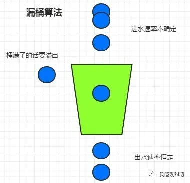

# 项目名称

Limiter 简易QPS限流策略，静态时间窗口（计数器）、滑动时间窗口、令牌桶、漏桶实现。

## 计数器

**算法思想：**

计数器是一种比较简单粗暴的限流算法，其思想是在固定时间窗口内对请求进行计数，与阀值进行比较判断是否需要限流，一旦到了时间临界点，将计数器清零。

**存在的问题：**

- 2个“时间窗口临界点”可能出现流量毛刺现象，系统可能承受不住瞬间流量，导致崩溃；
- 无法应对突发流量。

**代码参考：** [rate_limit.go](rate_limit.go)

## 滑动时间窗口

**算法思想：**

滑动窗口算法将一个大的时间窗口分成多个小窗口，每次大窗口向后滑动一个小窗口，并保证大的窗口内流量不会超出最大值，这种实现比固定窗口的流量曲线更加平滑。
对于滑动时间窗口，我们可以把1ms的时间窗口划分成10个小窗口，或者想象窗口有10个 `时间插槽time slot`, 每个`time slot`统计某个100ms的请求数量。每经过100ms，有一个新的`time slot`加入窗口，早于当前时间1s的`time slot`滑出窗口。窗口内最多维护10个`time slot`。

**存在的问题：**

滑动窗口算法是固定窗口的一种改进，但从根本上并没有真正解决固定窗口算法的临界突发流量问题。而且内存开销比较大。

**代码参考：** [sliding_window.go](sliding_window.go)

## 漏桶

**算法思想：**

漏桶算法是首先想象有一个木桶，桶的容量是固定的。当有请求到来时先放到木桶中，处理请求的worker以固定的速度从木桶中取出请求进行相应。如果木桶已经满了，直接返回请求频率超限的错误码或者页面。

**适用的场景：**

漏桶算法是流量最均匀的限流实现方式，一般用于流量“整形”。例如保护数据库的限流，先把对数据库的访问加入到木桶中，worker再以db能够承受的qps从木桶中取出请求，去访问数据库。

**存在的问题：**

`木桶流入请求的速率是不固定的，但是流出的速率是恒定的`。这样的话能保护系统资源不被打满，但是面对突发流量时会有大量请求失败，不适合电商抢购和微博出现热点事件等场景的限流。

**代码参考：** [leaky_bucket.go](leaky_bucket.go)

## 令牌桶

**算法思想：**

**令牌桶是反向的"漏桶"**，它是以恒定的速度往木桶里加入令牌，木桶满了则不再加入令牌。服务收到请求时尝试从木桶中取出一个令牌，如果能够得到令牌则继续执行后续的业务逻辑。如果没有得到令牌，直接返回访问频率超限的错误码或页面等，不继续执行后续的业务逻辑。
**特点：** `由于木桶内只要有令牌，请求就可以被处理，所以令牌桶算法可以支持突发流量。`

**参数设置：**

- 木桶的容量：考虑业务逻辑的资源消耗和机器能承载并发处理多少业务逻辑。
- 生成令牌的速率：太慢的话起不到“攒”令牌应对突发流量的效

**适用的场景：**

适合电商抢购或者微博出现热点事件这种场景，因为在限流的同时可以应对一定的突发流量。如果采用漏桶那样的均匀速度处理请求的算法，在发生热点时间的时候，会造成大量的用户无法访问，对用户体验的损害比较大。

**代码参考：** [token_bucket.go](token_bucket.go)
